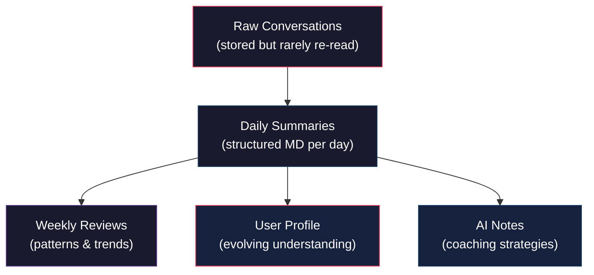
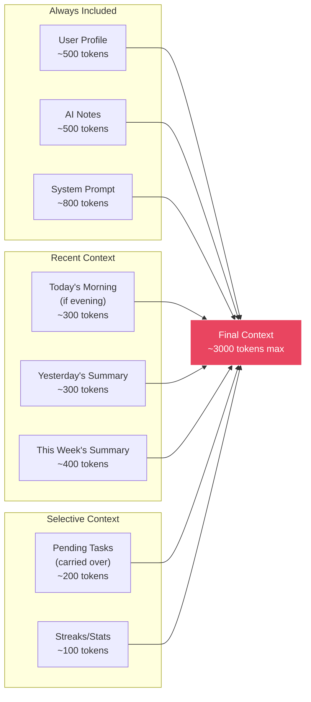
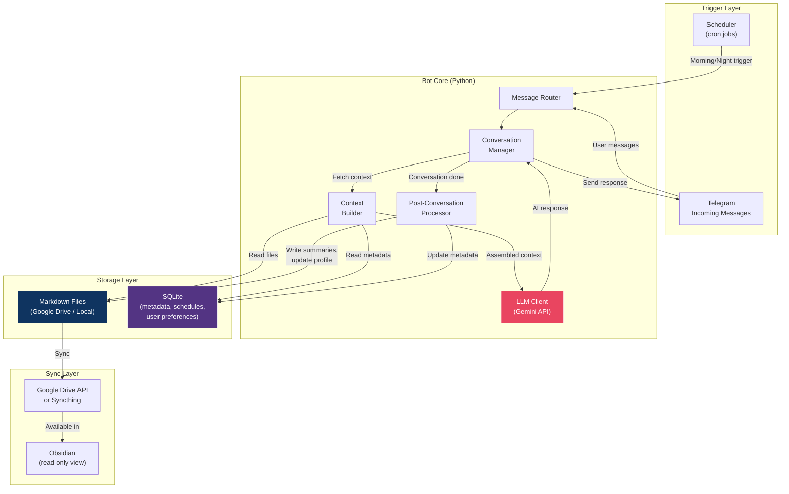
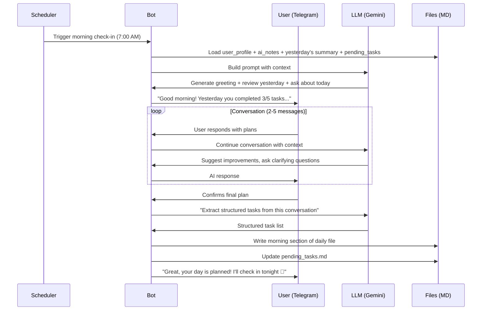
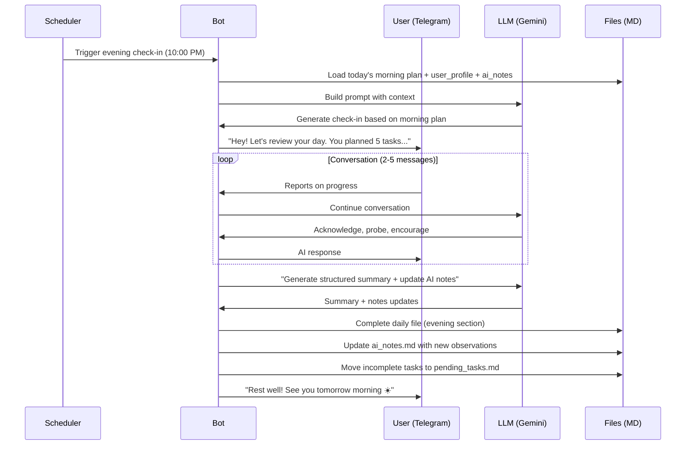

# Sensei — Concept Analysis & Architecture

## 1. Idea Refinement & Naming

### What This Actually Is
This is a **structured accountability companion** — an AI that acts as a personal coach with persistent memory, conducting daily check-ins to help you plan, execute, and reflect on your goals. The Obsidian integration makes your entire journey searchable, linkable, and reviewable.

### Name Suggestions
**Name chosen: Sensei.** Alternatives that were considered:

| Name | Vibe |
|------|------|
| **DayForge** | Crafting your day intentionally |
| **Pulse** | Daily rhythm / heartbeat of your productivity |
| **Cadence** | The rhythm of morning/night check-ins |
| **Mirror** | Reflects your progress back to you |
| **Anchor** | Grounds you in your goals daily |
| **Sensei** | The coach/mentor angle |

> [!TIP]
> Pick a name that you won't cringe at when your friends use it. "Sensei" or "Cadence" feel natural in conversation: *"Cadence reminded me I haven't touched my reading goal in 3 days"*

### Feature Enhancements Worth Considering

1. **Weekly Reviews** — Every Sunday, the AI generates a week-in-review summary. Patterns are much clearer at the weekly level than daily.
2. **Goal Hierarchy** — Don't just track tasks. Track *goals* (weekly/monthly) that daily tasks map to. This prevents the "I did 50 tasks but made no progress" trap.
3. **Streak & Consistency Tracking** — Simple counters for habits ("Day 12 of morning workouts"). Humans respond strongly to streaks.
4. **Mood/Energy Check-in** — A quick 1-5 rating at morning and night. Over time, this reveals patterns (e.g., "you're always low-energy on Mondays after skipping Sunday exercise").
5. **Flexible Check-in Timing** — Let users snooze or reschedule. Life happens.
6. **Mid-day Nudge (Optional)** — A brief "how's it going?" around 2-3 PM for users who want it.

---

## 2. Feasibility Analysis (Free Tier Focus)

### Cost Breakdown

| Component | Service | Free Tier | Sufficient? |
|-----------|---------|-----------|-------------|
| **LLM** | Google Gemini API | 15 RPM, 1M tokens/day (Gemini 2.0 Flash) | ✅ More than enough for 2-4 conversations/day per user |
| **Telegram Bot** | Telegram Bot API | Completely free, no limits | ✅ Perfect |
| **File Storage** | Google Drive API | 15 GB free | ✅ MD files are tiny (~1KB each). Years of use = ~50MB |
| **Hosting** | Multiple options (see below) | Varies | ⚠️ Needs careful selection |
| **Scheduler** | Built into hosting or cron service | Free | ✅ |
| **Database** | SQLite (local) or Supabase | Free | ✅ |

### Hosting Options (Free Tier)

| Platform | Free Tier | Pros | Cons |
|----------|-----------|------|------|
| **Oracle Cloud** | Always-free VM (1 GB RAM, 1 OCPU) | True always-on, no cold starts | Setup complexity |
| **Render** | 750 hrs/month web service | Easy deploy | Spins down after 15 min inactivity, cold starts |
| **Fly.io** | 3 shared VMs, 256MB each | Good for small bots | Limited memory |
| **Railway** | $5 free credit/month | Easy, great DX | Credits run out for always-on |
| **Home Raspberry Pi** | One-time cost ~$35 | Full control, no limits | Needs stable internet, your infra |
| **PythonAnywhere** | Free tier with scheduled tasks | Built-in cron, always available | Limited outbound HTTP on free tier |

> [!IMPORTANT]
> **Recommendation**: For a small friends group (3-5 users), an **Oracle Cloud free-tier VM** running the bot 24/7 is the best option. It's truly always-free, always-on, and gives you full control. Alternatively, if you have a machine at home that's always on, just run it there.

### LLM Choice Deep Dive

**Gemini 2.0 Flash** is the sweet spot:
- Free tier is very generous (1 million tokens/day)
- Fast responses (important for chat UX)
- Good at following structured prompts
- Supports system instructions well

For ~5 users with 2 conversations/day each, you'd use roughly:
- ~3,000 tokens per conversation (prompt + context + response)
- ~30,000 tokens/day total
- That's **3% of the free daily limit** — tons of headroom

> [!NOTE]
> If Gemini's free tier ever becomes restrictive, **Groq** (free tier with Llama models) is a solid fallback. The architecture should abstract the LLM provider so you can swap easily.

---

## 3. Architecture & Anti-Hallucination Pipeline

This is the most critical section. The #1 risk with a persistent AI companion is **memory drift** — the AI gradually "remembering" things that didn't happen or losing track of what actually did.

### Core Principle: The AI Knows Nothing — The Files Know Everything

The AI should **never** rely on its own "memory." Every conversation should be grounded in the actual markdown files. The AI is stateless between conversations; the files ARE the memory.

### Memory Architecture (Hierarchical)



### What Goes Into Each Conversation's Context



**Total context per conversation: ~3,000 tokens** — well within limits and small enough to prevent noise.

### Anti-Hallucination Strategies

| Strategy | Implementation |
|----------|---------------|
| **1. Structured extraction** | After each conversation, extract tasks/outcomes into structured YAML/frontmatter, not free-form prose. The AI summarizes, but data is stored in parseable format. |
| **2. User confirmation** | The AI always confirms: "So today you're planning to: 1) X, 2) Y, 3) Z — correct?" before saving. |
| **3. Ground truth files** | The AI cannot "remember" anything not written in the files. Every claim must trace back to a file. |
| **4. Append-only daily logs** | Daily files are never modified after creation (except marking tasks done). This prevents retroactive "editing" of history. |
| **5. Bounded context window** | Never feed more than 7 days of history. Older data is accessed only via weekly/monthly summaries. |
| **6. Explicit uncertainty** | System prompt instructs: "If you're unsure about something the user did or said previously, ASK rather than guess." |
| **7. Structured prompts** | Use rigid prompt templates that force the AI to work within guardrails, not freeform conversation. |
| **8. Checksums/validation** | After generating a summary, validate it against the raw conversation (e.g., count of tasks mentioned vs. stored). |

> [!CAUTION]
> The biggest hallucination risk is **summarization drift**. When you summarize a summary, details mutate. Mitigation: daily summaries are generated from RAW conversations, not from previous summaries. Weekly summaries are generated from daily summaries + raw data where needed.

### System Architecture



---

## 4. File Structure (Obsidian Vault)

```
📁 sensei/
├── 📄 _user_profile.md          # Who the user is, goals, preferences
├── 📄 _ai_notes.md              # AI's coaching notes (what works/doesn't)
├── 📄 _pending_tasks.md         # Carried-over incomplete tasks
├── 📁 daily/
│   ├── 📄 2026-06-01.md         # Daily log (morning plan + evening review)
│   ├── 📄 2026-06-02.md
│   └── ...
├── 📁 weekly/
│   ├── 📄 2026-W22.md           # Weekly review & patterns
│   └── ...
└── 📁 conversations/            # Raw conversation logs (optional, for audit)
    ├── 📄 2026-06-01-morning.md
    ├── 📄 2026-06-01-evening.md
    └── ...
```

### Example: Daily File (`2026-06-01.md`)

```markdown
---
date: 2026-06-01
mood_morning: 4
mood_evening: 3
energy_morning: 3
energy_evening: 2
tasks_planned: 5
tasks_completed: 3
---

# June 1, 2026 — Sunday

## 🌅 Morning Plan
- [x] 30-min workout (running)
- [x] Read 20 pages of "Atomic Habits"
- [ ] Complete API integration for work project *(carried over → June 2)*
- [x] Call mom
- [ ] Grocery shopping *(skipped — rain)*

## 🌙 Evening Review
**What went well:** Workout felt great, finished reading chapter early.
**What didn't:** Got distracted after lunch, lost 2 hours to YouTube.
**Key insight:** Afternoons are still a weak spot. Maybe try a post-lunch walk?

## AI Observations
- User responds well to specific time-blocking suggestions
- Afternoon distraction is a recurring pattern (3rd time this week)
- Positive: workout streak is now at 5 days
```

### Example: User Profile (`_user_profile.md`)

```markdown
---
name: [User's name]
timezone: Asia/Kolkata
morning_checkin: "07:00"
evening_checkin: "22:00"
coaching_style: balanced  # gentle | balanced | strict
goals_updated: 2026-06-01
---

# User Profile

## Current Goals
1. **Health**: Exercise 5x/week, improve sleep schedule
2. **Career**: Ship side project MVP by end of June
3. **Learning**: Read 2 books/month
4. **Personal**: Better work-life boundaries

## Preferences
- Prefers bullet-point responses over long paragraphs
- Likes when AI suggests specific actionable tasks
- Responds well to data ("you've hit 80% of your workout goals this month")
- Does NOT like being lectured — prefers collaborative tone

## Patterns (Updated Weekly)
- Most productive: Mornings (7-11 AM)
- Least productive: Post-lunch (1-3 PM)
- Weekend productivity: Lower, and that's okay
- Typical blockers: YouTube rabbit holes, overcommitting to tasks
```

### Example: AI Notes (`_ai_notes.md`)

```markdown
# AI Coaching Notes

## What Works
- Asking "what's the ONE thing you must do today?" helps prioritize
- Celebrating small wins increases next-day task completion
- Comparing to last week (not yesterday) reduces frustration
- User responds better to questions than statements

## What Doesn't Work
- Long motivational speeches → user disengages
- Too many suggested tasks → overwhelm
- Strict tone on low-energy days → backfires
- Asking about exercise on rest days → annoying

## Coaching Adjustments Log
| Date | Observation | Adjustment |
|------|-------------|------------|
| 2026-05-28 | User seemed annoyed by repeated exercise reminders | Reduce frequency, only mention if user brings it up |
| 2026-05-30 | Praise for 5-day streak led to 6th day | Continue streak-based motivation for workouts |
```

---

## 5. Conversation Flow Pipeline

### Morning Flow



### Evening Flow



---

## 6. Tech Stack Summary

| Layer | Technology | Why |
|-------|-----------|-----|
| **Language** | Python 3.11+ | Best Telegram bot ecosystem, great Gemini SDK |
| **Telegram** | `python-telegram-bot` library | Mature, async, well-documented |
| **LLM** | Google Gemini 2.0 Flash (via `google-genai` SDK) | Free tier, fast, good instruction following |
| **Scheduler** | `APScheduler` (in-process) | No external dependency, timezone-aware |
| **Database** | SQLite (via `aiosqlite`) | Zero setup, sufficient for <10 users |
| **File Sync** | Google Drive API (`google-api-python-client`) | Free 15GB, API access, works with any device |
| **Alt File Sync** | Syncthing (if self-hosting) | No cloud dependency, real-time sync |
| **Config** | `.env` file + `pydantic-settings` | Clean, typed, 12-factor compliant |
| **Hosting** | Oracle Cloud free VM / Home server | Always-on, truly free |

---

## 7. Multi-User Considerations

Since this is for you and friends:

- **Separate vaults per user**: Each user gets their own folder in the cloud storage. No data mixing.
- **User registration**: Simple `/start` command in Telegram that collects basic info (name, timezone, preferred check-in times).
- **Per-user scheduling**: Each user can have different morning/evening times.
- **Shared nothing**: Each conversation is fully isolated. The AI has no cross-user knowledge.

---

## 8. Potential Pitfalls & Mitigations

| Pitfall | Mitigation |
|---------|-----------|
| **User stops responding** | After 2 days of no response, reduce to a single gentle daily message. After 5 days, go to weekly. Never spam. |
| **Context grows too large** | Hard cap at 7 days of daily context. Older data only via weekly summaries. Aggressive pruning. |
| **AI becomes repetitive** | Rotate prompt templates. Track which suggestions have been made recently. Vary greeting styles. |
| **User lies about completion** | Don't judge. The AI is a tool, not a parent. Over time, patterns will be visible in the data. |
| **Telegram rate limits** | Not an issue at this scale. Telegram allows ~30 messages/second per bot. |
| **Google Drive API limits** | Free tier: 10,000 queries/100 seconds. At 2 conversations/day/user, you'd use ~20 queries/day. Not even close. |
| **Gemini API changes** | Abstract LLM behind an interface. Support Groq/Ollama as fallback providers with a config switch. |
| **File conflicts (Obsidian sync)** | Bot writes, human reads. If human edits, bot should detect and respect changes (check file modified timestamp). |

---

## Open Questions

> [!IMPORTANT]
> **Q1: File sync preference?**
> - **Option A**: Google Drive API (bot reads/writes via API, you access via Drive/Obsidian)
> - **Option B**: Syncthing (bot writes to local folder, Syncthing syncs to your devices)
> - **Option C**: GitHub repo (bot commits MD files, you pull on Obsidian)
> 
> Each has trade-offs. Google Drive is easiest but adds API complexity. Syncthing is simplest but requires a shared network or relay. GitHub is overkill but gives you version history for free.

> [!IMPORTANT]  
> **Q2: How many friends will use this?**
> This affects hosting choice. 2-3 users can run on practically anything. 10+ users might need a beefier setup.

> [!IMPORTANT]
> **Q3: Do you want to interact via Telegram only, or also edit MD files directly in Obsidian?**
> If you want to edit files in Obsidian (e.g., manually add tasks), the bot needs conflict resolution logic. If Obsidian is read-only, it's much simpler.

> [!IMPORTANT]
> **Q4: What's your hosting preference?**
> Do you have a machine at home that's always on? Or would you prefer a cloud VM?

> [!IMPORTANT]
> **Q5: Coaching style personalization — per user from the start, or one style for everyone initially?**
> Building adaptive coaching from day 1 adds complexity. A simpler v1 could start "balanced" and you manually adjust via the profile file.

---

## Verification Plan

### Phase 1 — Proof of Concept (Week 1)
- [ ] Telegram bot responds to messages
- [ ] Gemini API integration works
- [ ] Bot can read/write local MD files
- [ ] Morning/evening cron triggers work

### Phase 2 — Core Loop (Week 2-3)
- [ ] Full morning conversation flow
- [ ] Full evening conversation flow  
- [ ] Context builder assembles correct files
- [ ] Post-conversation processor generates structured summaries
- [ ] Pending task carry-over works

### Phase 3 — Polish (Week 3-4)
- [ ] Multi-user support
- [ ] Cloud sync (Drive/Syncthing)
- [ ] Weekly review generation
- [ ] AI notes auto-updating
- [ ] Edge cases (user doesn't respond, late responses, etc.)

### Phase 4 — Hardening
- [ ] Run for 7 days personally
- [ ] Audit generated files for accuracy
- [ ] Check for hallucination/drift
- [ ] Invite 1-2 friends for testing
